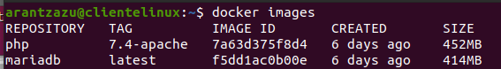

## EJERCICIO 1 - Trabajo con Imágenes

### 1.1- Servidor Web

Arrancamos un contendedor en Docker en el que ejecuto una instancia de la imagen php:7.4-apache, el contenedor se llamará web y será accesible desde un navegador por el puerto 8000.

Además he creado un volumen  con la opción `-v` con la ubicación en nuestra máquina cliente en. /home/arantzazu/web y que se sincroniza con una carpeta de nuestro contenedor ubicada en /var/www/html. Así cualquier cambio que hagamos en nuestro contenedor o nuestra máquina va a verse reflejados en ambos.

```
docker run -d --name web -v /home/arantzazu/web:/var/www/html -p 8000:80 php:7.4-apache
```


Resultado de la ejecución 

Comprobamos que se ha creado el contenedor con :

```
docker ps -a
```


Entramos en el contenedor y listamos los archivos que tenemos en las carpeta /var/www/html

```
docker exec -it web bash
```

una vez dentro del contenedor con `ls`, listamos los archivos que tenemos, en este caso tendremos index.html y mes.php


Captura de pantalla de mi carpeta en la máquina cliente con los archivos solicitados y que está sincronizada con la carpeta del contenedor.


Ahora seguimos dentro del contenedor y nos vamos a la carpeta etc/apache2/mods-enabled  para instalar php7 y comprobamos que **php7.load** está en mods-enabled y hacemos un `restart` a apache

```
apt-get install php7 libapache2-mod-php7 php7-cli
```


Comprobamos desde un navegador que se ejecuta el script del archivo mes.php . Tiene que salir el numero correspondiente al mes en el que estamos.


El codigo php fue creado en Visual Studio Code y es el siguiente:


El codigo para el archivo index.html fue creado en Visual Studio Code y es el siguiente:


y la salida en el navegador es la siguiente:


El contenedor Docker creado es el siguiente:


Ahora borramos el contenedor :

```
docker rm web
```

IMPORTANTE: Lo borro al final del ejercicio 1.2, porque así muestro en una captura los dos contenedores creados para estos dos ejercicios

### 1.2- Servidor Base de Datos

Descargo la imagen de docker de MariaDB desde el repositorio en línea.

```
docker pull mariadb
```

captura de la ejecución


Enumero las imagenes de docker instaladas en el sistema:

```
docker images
```



Inicio un nuevo contenedor de Docker de MariaDB con esta imagen de Docker:

```
docker run --detach --name bbdd --env MARIADB_USER=invitado --env MARIADB_PASSWORD=invitado --env MARIADB_ROOT_PASSWORD=root --env MARIADB_DATABASE=prueba mariadb:latest

```

Captura de la ejecución para la creación del contenedor:


Comprobamos que se ha creado el contenedor con MariaDB:


Me conecto al contenedor recién creado con una sesion shell usando el comando:

```
docker exec -it bbdd bash
```


Lo primero que hago es actualizar Ubuntu.

```
apt update && upgrade -y
```


Entramos en la base de datos con el comando:

```
mysql -u invitado -p
```

nos pedirá la contraseña ( no se ve según telceas, pero la contraseña es: invitado)


Visualizamos la base de datos creada con el comando show databases:

```
show databases;
```


Salimos de la base de datos con exit:


Salimos del contenedor con exit:


Visualizamos las imágenes que tenemos:

```
docker images
```


Intento borrar la imagen de mariadb:

```
docker rmi mariadb
```

y vemos que no se puede borrar, mientras un contenedor esté usando la imagen:


Ahora borramos ambos contenedores creados para los dos anteriores ejecicios:

Primero los visualizamos:

```
docker ps -a
```


y luego los detenemos ( en el caso que esté UP y los eliminamos):

```
docker stop $(docker ps -a -q)
```


```
docker rm $(docker ps -a -q)
```


Comprobar que se han eliminado:

```
docker ps 

docker ps -a
```


