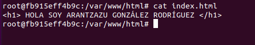

Arantzazu González Rodríguez

DAW La Laboral

## EJERCICIO 2 - Almacenamiento

### 2.1- Bind mount para compartir datos

Creo una carpeta llamada *saludo y dentro de ella un fichero llamado index.html:

```
mkdir saludo
cd saludo
echo "<h1> HOLA SOY ARANTZAZU GONZÁLEZ RODRÍGUEZ </h1>" > index.html

```

Captura del directorio del sistema del archivo del host, donde se ve la carpeta creada y el fichero `html`


Visualizo las imagenes que tengo:

```
docker images
```


Ahora creo un dos contenedores basados en la imagen php:7.4-apache que hagan un bind mount de la carpeta saludo en la carpeta /var/www/html del contenedor. Uno de ellos vamos a acceder con el puerto <u>8181</u> y el otro con el <u>8282</u> y sus nombres serán **c1** y **c2**

Creo el primer contenedor llamado c1 y accede por el puerto 8181

```
docker run -d --name c1 --mount type=bind,src=/home/arantzazu/saludo,dst=/var/www/html -p 8181:80 php:7.4-apache
```


Creo el segundo contenedor llamado c2 y accede por el puerto 8282:

```
docker run -d --name c2 --mount type=bind,src=/home/arantzazu/saludo,dst=/var/www/html -p 8282:80 php:7.4-apache
```


Pantallazo donde se pueden ver los dos contenedores creados:

```
docker ps -a
```


Pantallazo donde se ve que accediendo a **c1** se puede ver el contenido de index.html

```
docker exec -it c1 bash
```

una vez dentro listamos contenido y vemos index.html :

```
ls
```


y con el comando `cat` , podemos ver el contenido:

```
cat index.html
```



salimos del contenedor 

```
exit
```


Hacemos lo mismo para el contenedor **c2**

```
docker exec -it c2 bash
```

**repetimos los pasos de c1 en c2


Paramos los contenedores:

```
docker stop $(docker ps -a -q)
```


Modificamos el contenido de index.html

```
echo "<h1> ADIOS ARANTZAZU GONZÁLEZ RODRÍGUEZ </h1>" > saludo/index.html
```

Mostramos el contenido de index.html a través del navegador, accediendo a localhost:8181 y localhost:8282 , vemos que se ha cambiado el HOLA  por un ADIOS.


Reiniciamos los contenedores :

```
docker start c1

docker start c2
```


Accedemos al contenedor **c1** para comprobar que los cambios en index.html también están en la carpeta del contenedor que lo contiene ( el archivo html, lo habíamos modificado en la máquina cliente)

```
docker exec -it c1 bash
```

Una vez dentro 

```
ls

cat index.html
```

y comprobamos que ahora el index.html en la cabecera dice "Adios " en vez de "Hola" como al principio.


Hacemos lo mismo para el contenedor **c2**

```
docker exec -it c2 bash
```


Ahora paramos los contenedores;

```
docker stop $(docker ps -a -q)
```


y los eliminamos

```
docker rm $(docker ps -a -q)
```


comprobamos que han sido eliminados:

```
docker ps -a
```


