## EJERCICIO 4 - Imagen con DockerFile

Creo una carpeta en Home llamada <u>dockerweb</u>

```
mkdir ~/dockerweb/
```

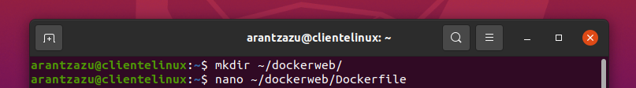

creamos un archivo llamado Dockerfile:

```
nano ~/dockerweb/Dockerfile
```

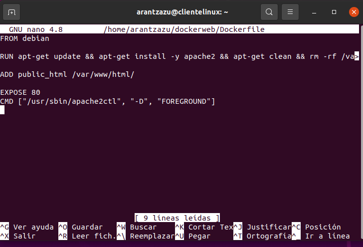

Explicando el contenido del Dockerfile:

- debian: es el sistema operativo donde se van a montar los programas
- RUN apt-get update: aplicaciones a instalar o actualizar
- ADD public_html /var/www/html/: copiar del directorio home al directorio de apache del contenedor
- expose 80: puerto que va a quedar abierto
- CMD /usr/sbin/apache2vtl -D FOREGROUND: ejecutar en la terminal como demonio.

Ahora ejecutamos en docker el contenido de Dockerfile:

```
sudo docker build -t web ~/dockerweb/
```

donde :

- web : es el nombre de la nueva imagen que crearemos
- ~/dockerweb/: Path donde está nuestro Dockerfile.

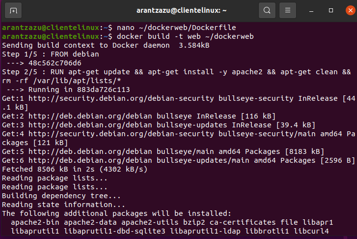

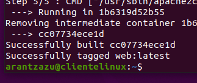

en nuestras imagenes de docker vamos a ver la nueva imagen creada:

```
docker images
```

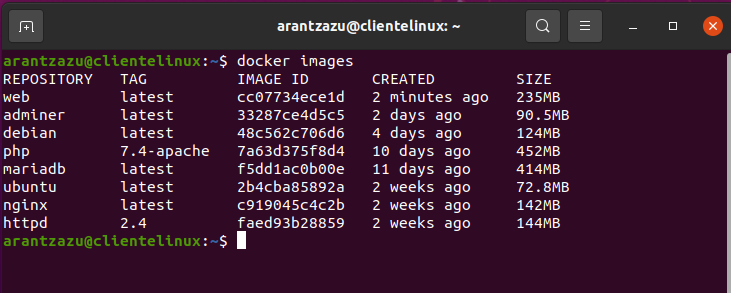

ahora creamos el contenedor con la imagen creada y que hemos llamado **web**

```
docker run -d -p 8086:80 --name arantxa web:latest
```

Si abrimos en una página de un navegador, vemos la web desplegada. Escribimos http://localhost:8086

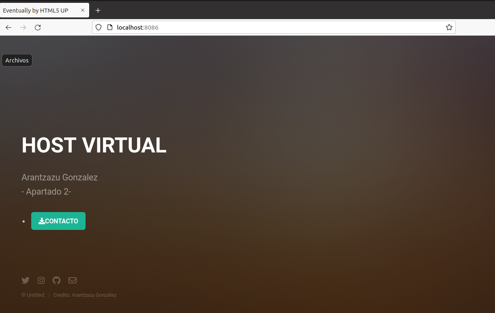

Hacemos clic en el botón contacto y accedemos a la página "/contacto"

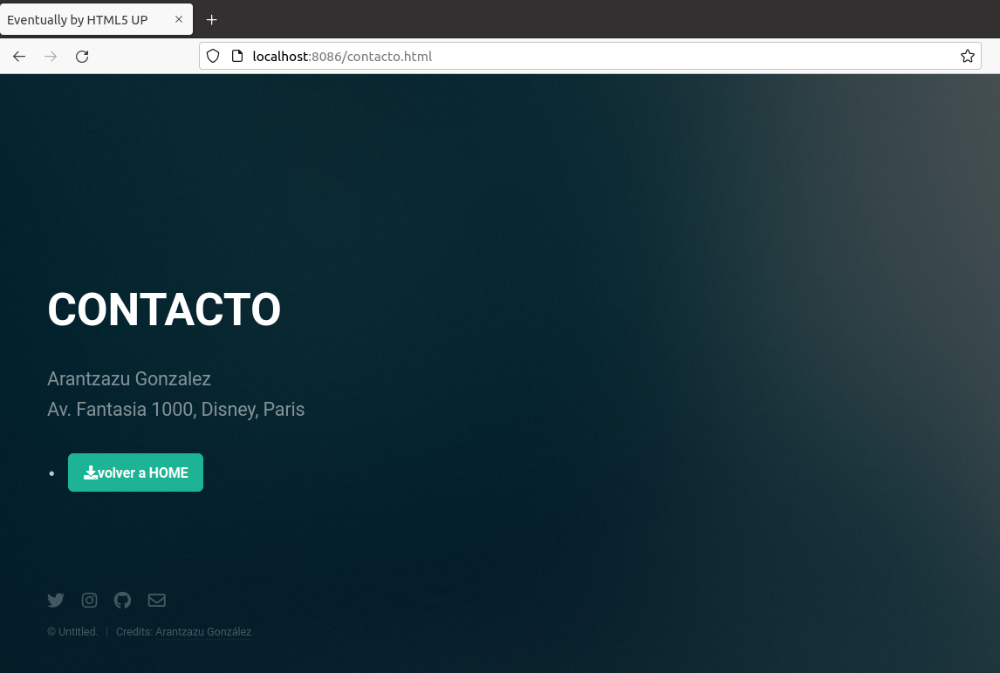

Captura de pantalla de las carpetas en el host cliente:

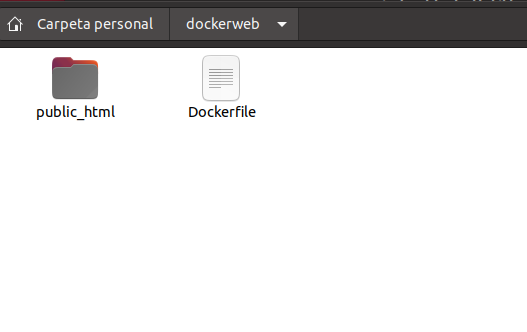

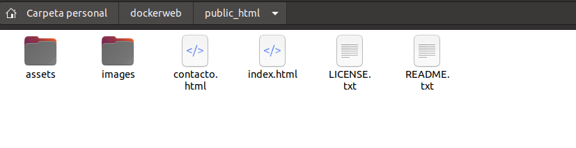

Solamente nos quedaría subir nuestra imagen a Docker Hub. Pero primero nos aseguramos de estar en la carpeta correcta:

```
cd /home/arantzazu/dockerweb/
```

listamos el contenido de esta carpeta, para asegurarnos que sea la correcta

```
ls
```

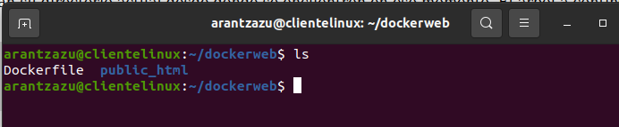

Ahora solo quedaría subir la imagen a DOCKER HUB

```
docker login

```

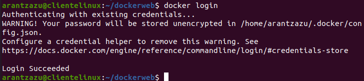

Etiqueto la construcción de mi imagen

```
docker tag web:latest arigonzalezr/web:ari
```

y ahora subo la imagen

```
docker push arigonzalezr/web:ari
```

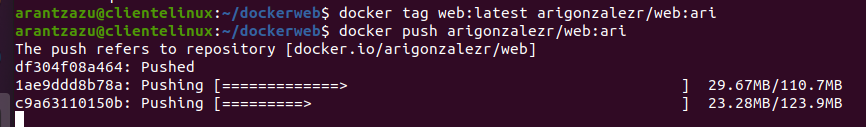

Muestro mi imagen subida a DockerHub

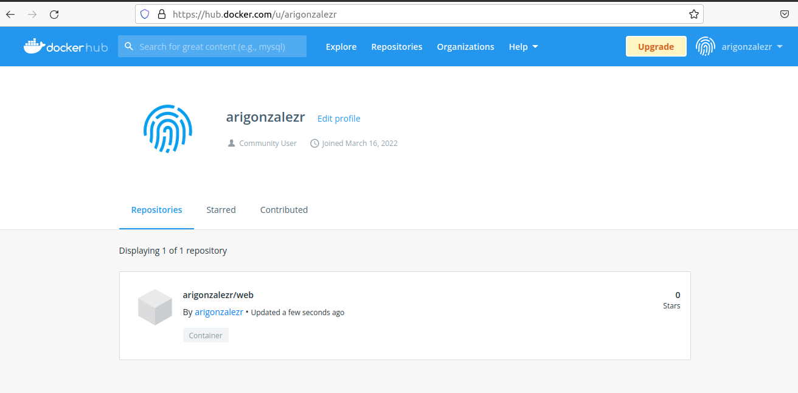
